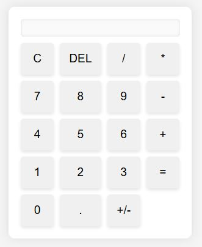
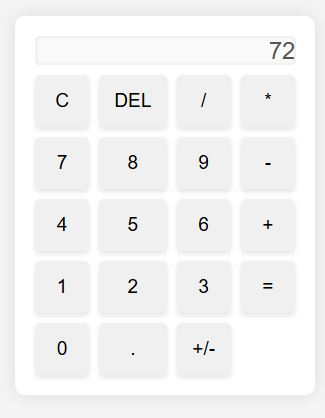
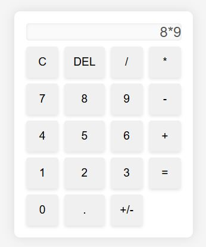

# Simple Calculator
---
# Description
A simple calculator that is capable of doing basic addition, subtraction, multiplication, and division. 
---
# How To Run:
1. Clone the repo
2. Open in IDE/Text Editor
3. Open HTML file in your browser
---
# Images 

---
# References:
- https://www.w3schools.com/jsref/jsref_reference.asp
